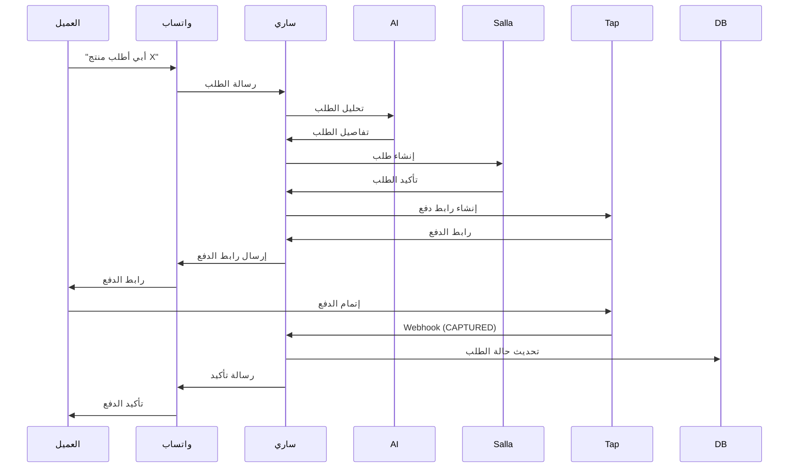
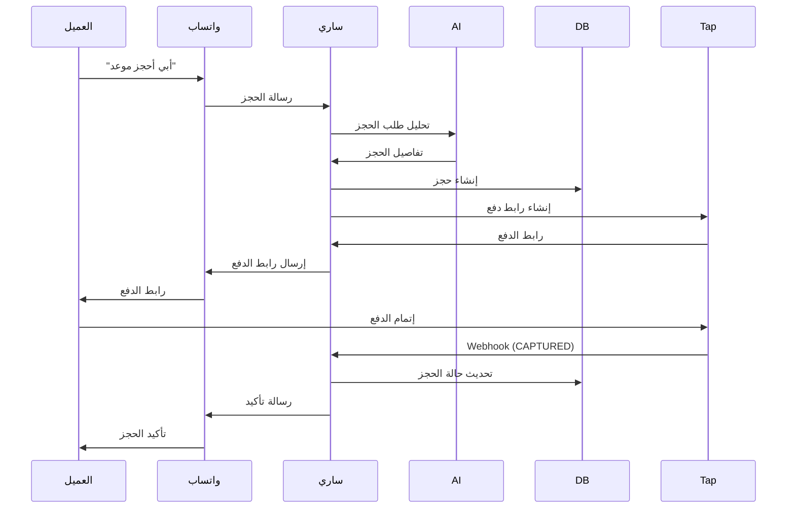

# دليل نظام الدفع Tap Payments - ساري

## نظرة عامة

تم دمج نظام الدفع Tap Payments بالكامل مع منصة ساري لتوفير تجربة دفع سلسة وآمنة للعملاء. يشمل النظام:

1. **إنشاء روابط دفع تلقائية** عند تأكيد الطلبات والحجوزات
2. **إرسال روابط الدفع عبر واتساب** مباشرة للعملاء
3. **معالجة Webhooks التلقائية** من Tap لتحديث حالة المعاملات
4. **إشعارات واتساب التلقائية** عند نجاح أو فشل الدفع
5. **صفحة تفاصيل شاملة** لكل معاملة مع سجل كامل

---

## الميزات الرئيسية

### 1. دمج روابط الدفع مع WhatsApp Bot

#### الطلبات (Orders)
عند إنشاء طلب من محادثة واتساب:
- يتم إنشاء رابط دفع Tap تلقائياً
- يُرسل الرابط فوراً للعميل عبر واتساب
- الرابط صالح لمدة 24 ساعة
- يحتوي على جميع تفاصيل الطلب

**مثال على الرسالة:**
```
💳 رابط الدفع جاهز!

📦 رقم الطلب: ORD-12345
💰 المبلغ: 250.00 ريال

🔒 لإتمام الدفع بشكل آمن:
https://tap.company/pay/xxxxx

✅ الدفع مؤمن بالكامل عبر Tap Payments
⏰ الرابط صالح لمدة 24 ساعة
📱 ستصلك رسالة تأكيد فور إتمام الدفع

شكراً لثقتك بنا! 🌟
```

#### الحجوزات (Bookings)
عند إنشاء حجز من محادثة واتساب:
- يتم إنشاء رابط دفع Tap تلقائياً
- يُرسل الرابط مع تفاصيل الحجز
- يتم تأكيد الحجز فور إتمام الدفع

**مثال على الرسالة:**
```
💳 رابط الدفع جاهز!

📅 الحجز: قص شعر رجالي
📆 التاريخ: 2024-01-15
⏰ الوقت: 10:00 - 10:30
💰 المبلغ: 50 ريال

🔒 لإتمام الدفع:
https://tap.company/pay/xxxxx

✅ الدفع مؤمن عبر Tap Payments
⏰ الرابط صالح لمدة 24 ساعة

شكراً لثقتك! 🌟
```

---

### 2. معالجة Webhooks التلقائية

يستقبل النظام إشعارات من Tap عند تغيير حالة الدفع:

#### الحالات المدعومة:
- **CAPTURED**: دفع ناجح ✅
- **FAILED**: دفع فاشل ❌
- **DECLINED**: دفع مرفوض ❌
- **CANCELLED**: دفع ملغي 🚫
- **REFUNDED**: استرجاع المبلغ 💸

#### الإجراءات التلقائية:

**عند نجاح الدفع (CAPTURED):**
1. تحديث حالة المعاملة إلى "مكتمل"
2. تحديث حالة الطلب/الحجز إلى "مدفوع/مؤكد"
3. إرسال رسالة تأكيد للعميل عبر واتساب
4. حفظ سجل الـ webhook

**رسالة النجاح للطلب:**
```
✅ تم استلام الدفع بنجاح!

📦 رقم الطلب: ORD-12345
💰 المبلغ: 250.00 ريال

🎉 طلبك قيد المعالجة الآن
📱 سنرسل لك تحديثات عن حالة الشحن

شكراً لثقتك بنا! 🌟
```

**عند فشل الدفع (FAILED/DECLINED):**
1. تحديث حالة المعاملة إلى "فاشل"
2. تحديث حالة الطلب/الحجز إلى "فشل الدفع/ملغي"
3. إرسال رسالة للعميل مع خيار إعادة المحاولة

**رسالة الفشل:**
```
❌ فشلت عملية الدفع

📦 رقم الطلب: ORD-12345

يرجى المحاولة مرة أخرى أو التواصل معنا للمساعدة.

نعتذر عن الإزعاج 🙏
```

---

### 3. صفحة تفاصيل المعاملة

صفحة شاملة لعرض جميع معلومات المعاملة:

#### المعلومات المعروضة:
- **معلومات المعاملة**: رقم المعاملة، الحالة، التاريخ
- **المبلغ**: المبلغ الإجمالي بالعملة
- **معلومات العميل**: الاسم، الجوال، البريد الإلكتروني
- **معلومات الدفع**: معرف Tap، طريقة الدفع، الوصف
- **سجل التحديثات (Timeline)**: جميع التحديثات مع التواريخ
- **الطلب/الحجز المرتبط**: رابط مباشر للطلب أو الحجز

#### الإجراءات المتاحة:
- ✅ **طباعة الإيصال**: طباعة مباشرة من المتصفح
- ✅ **تصدير PDF**: تحميل الإيصال بصيغة PDF
- ✅ **تصدير JSON**: تحميل البيانات الكاملة
- ✅ **إرسال عبر واتساب**: إرسال الإيصال للعميل

---

## البنية التقنية

### الملفات الرئيسية

#### Backend:
```
server/
├── _core/
│   └── tapPayments.ts          # دوال Tap API
├── automation/
│   └── order-from-chat.ts      # دمج روابط الدفع مع الطلبات
├── webhooks/
│   ├── tap-webhook.ts          # معالج Webhooks
│   └── tap-webhook.test.ts     # اختبارات Webhooks
├── db_payments.ts              # دوال قاعدة البيانات
└── routers.ts                  # APIs (payments.handleWebhook)
```

#### Frontend:
```
client/src/pages/
├── PaymentDetails.tsx          # صفحة تفاصيل المعاملة
└── merchant/
    ├── Payments.tsx            # قائمة المعاملات
    └── PaymentLinks.tsx        # روابط الدفع
```

### قاعدة البيانات

#### جداول الدفع:
1. **order_payments**: معاملات الدفع
2. **payment_links**: روابط الدفع
3. **payment_refunds**: عمليات الاسترجاع

---

## الإعدادات المطلوبة

### متغيرات البيئة (Environment Variables):

```env
# Tap Payments API Keys
TAP_SECRET_KEY=sk_test_xxxxx           # مفتاح Tap السري
TAP_PUBLIC_KEY=pk_test_xxxxx           # مفتاح Tap العام
TAP_WEBHOOK_SECRET=whsec_xxxxx         # سر التحقق من Webhooks
```

### إعداد Webhooks في Tap:

1. تسجيل الدخول إلى [لوحة تحكم Tap](https://dashboard.tap.company)
2. الانتقال إلى Settings → Webhooks
3. إضافة Webhook URL الجديد:
   ```
   https://your-domain.com/api/trpc/payments.handleWebhook
   ```
4. تفعيل الأحداث التالية:
   - `charge.captured`
   - `charge.failed`
   - `charge.declined`
   - `charge.cancelled`
   - `charge.refunded`

---

## APIs المتاحة

### 1. إنشاء معاملة دفع
```typescript
trpc.payments.createCharge.useMutation({
  amount: 100,
  currency: 'SAR',
  customerName: 'أحمد محمد',
  customerPhone: '+966501234567',
  description: 'طلب رقم ORD-12345',
  orderId: 123,
  redirectUrl: 'https://example.com/success',
});
```

### 2. التحقق من حالة الدفع
```typescript
trpc.payments.verifyPayment.useQuery({
  chargeId: 'chg_xxxxx'
});
```

### 3. الحصول على تفاصيل معاملة
```typescript
trpc.payments.getById.useQuery({
  id: 123
});
```

### 4. قائمة المعاملات
```typescript
trpc.payments.list.useQuery({
  status: 'captured',
  limit: 50
});
```

### 5. إحصائيات الدفع
```typescript
trpc.payments.getStats.useQuery({
  startDate: '2024-01-01',
  endDate: '2024-01-31'
});
```

### 6. إنشاء استرجاع
```typescript
trpc.payments.createRefund.useMutation({
  paymentId: 123,
  amount: 50,
  reason: 'طلب العميل'
});
```

### 7. معالجة Webhook
```typescript
trpc.payments.handleWebhook.useMutation({
  payload: webhookData,
  signature: 'signature_from_tap'
});
```

---

## تدفق العمل الكامل

### سيناريو 1: طلب من واتساب



### سيناريو 2: حجز من واتساب



---

## الأمان

### التحقق من Webhooks:
- يتم التحقق من توقيع HMAC SHA256 لكل webhook
- يتم رفض أي webhook بتوقيع غير صحيح
- يتم حفظ سجل لجميع الـ webhooks

### تشفير البيانات:
- جميع الاتصالات مع Tap عبر HTTPS
- لا يتم حفظ بيانات البطاقات في النظام
- يتم حفظ معرف المعاملة فقط

---

## الاختبار

### تشغيل الاختبارات:
```bash
pnpm test server/webhooks/tap-webhook.test.ts
```

### اختبارات متاحة:
- ✅ التحقق من التوقيع الصحيح
- ✅ رفض التوقيع الخاطئ
- ✅ معالجة دفع ناجح
- ✅ معالجة دفع فاشل
- ✅ معالجة webhook لمعاملة غير موجودة

---

## استكشاف الأخطاء

### مشكلة: لا يتم إرسال رابط الدفع

**الحلول:**
1. تحقق من وجود `TAP_SECRET_KEY` في متغيرات البيئة
2. تحقق من اتصال Green API
3. راجع logs السيرفر للأخطاء

### مشكلة: Webhook لا يعمل

**الحلول:**
1. تحقق من URL الـ webhook في لوحة Tap
2. تحقق من `TAP_WEBHOOK_SECRET`
3. تحقق من أن السيرفر يقبل POST requests

### مشكلة: حالة الدفع لا تتحدث

**الحلول:**
1. تحقق من logs الـ webhooks
2. تحقق من حالة المعاملة في لوحة Tap
3. أعد إرسال الـ webhook من لوحة Tap

---

## الخطوات التالية

### تحسينات مستقبلية:
- [ ] دعم الدفع بالتقسيط
- [ ] دعم Apple Pay و Google Pay
- [ ] تقارير مالية متقدمة
- [ ] دعم عملات إضافية
- [ ] نظام استرجاع جزئي
- [ ] إشعارات بريد إلكتروني

---

## الدعم

للمساعدة أو الاستفسارات:
- 📧 البريد الإلكتروني: support@sari.sa
- 📱 واتساب: +966 XX XXX XXXX
- 🌐 الموقع: https://sari.sa

---

**آخر تحديث:** يناير 2024
**الإصدار:** 1.0.0
